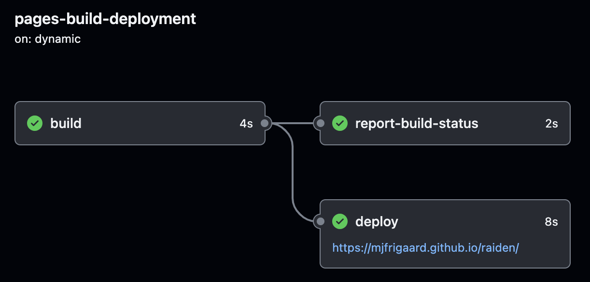

# raiden 0.1.0

-   Create `raidenApp()` and `gather_*()` functions
-   `pkgdown` builds
    -   error with `purrr` (see [issue #1](https://github.com/mjfrigaard/raiden/issues/1))
        -   `pkgdown` #4: Commit [f26e040](https://github.com/mjfrigaard/raiden/commit/f26e04073763e8a412905febf55c515af83489ad) (FAIL)
            -   install with `pak`
            -   `renv::snapshot()`
                -   "\* The lockfile is already up to date"
            -   `pkgdown::build_site_github_pages()`
            -   commit/push
        -   `pkgdown` #5: Commit [42775a7](https://github.com/mjfrigaard/raiden/commit/42775a75993af0637b051cac4970524b7cb9cf92)
            -   Added `purrr` to `DESCRIPTION`
                -   loaded, documented, installed
                -   `renv::snapshot()`
                    -   "\* The lockfile is already up to date"
                -   `pkgdown::build_site_github_pages()`
                -   commit/push
                -   Success! See [run](https://github.com/mjfrigaard/raiden/actions/runs/5607123136)
            
{fig-align='center'}
