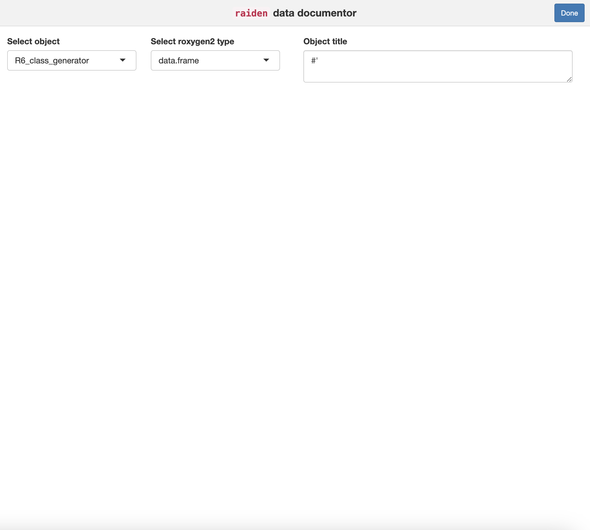

<!-- README.md is generated from README.Rmd. Please edit that file -->

# `raiden`

<!-- badges: start -->
<!-- badges: end -->

**R**oxygen2 **A**dd**I**n for **D**ocum**E**ntatio**N** in R

## Installation

You can install the development version of `raiden` like so:

``` r
install.packages("remotes")
remotes::install_github("mjfrigaard/raiden")
```

## Background

The `raiden` package contains an RStudio Addin for documenting R
objects–primarily functions, datasets (`tibble`s and `data.frame`s), and
methods (like `R6`). Resources for developing `raiden` come from the
[RStudio Addins](https://rstudio.github.io/rstudioaddins/) and
[Designing Gadget
UI](https://shiny.posit.co/r/articles/build/gadget-ui/) articles.

`raiden` is designed to be called when a user has an object in the
global environment they’d like to document with `roxygen2` tags.

### Example

Creating objects to document:

``` r
library(R6)
my_list <- list('mtcars' = datasets::mtcars,
                'attitude' = datasets::attitude,
                'titanic' = datasets::Titanic)
mtcars <- datasets::mtcars
R6_class_generator <- R6Class()
R6_object <- R6_class_generator$new()
```

Then run `raiden::raidenApp()` to view the Addin (beta):



Users can select:

1.  Object name
2.  roxygen2 type

Then enter:

3.  Object title

This populates the appropriate `roxygen2` template.
